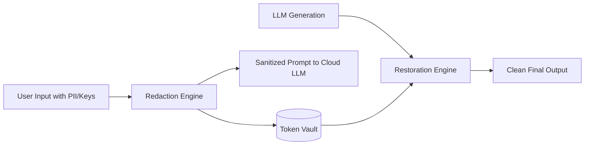

# genpark-pii-secret-redaction-masking-skill

High-speed PII and secret redaction engine with reversible token vault and credential sanitization.

Published by **GenPark AI** (https://genpark.ai). Discover more safety tooling on the **GenPark Model Context Protocol Directory** (https://genpark.ai/mcp).

## Features
- **Reversible Token Vault**: Securely de-anonymizes LLM responses without exposing raw credentials to external APIs.
- **Zero External Dependencies**: Pure Python standard library regex engine.
